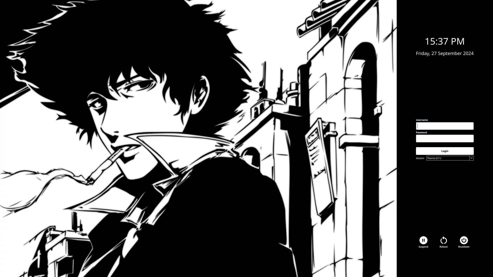

# Just Chill Theme

A simple theme to log into your computer and just chill



## Dependencies

- SDDM
- Qt 5
- Qt Quick Controls 2
- Qt SVG

## Installation

### Clone and copy the theme folder

```
  git clone https://github.com/redasalmi/sddm-just-chill-theme.git
  sudo cp -r sddm-just-chill-theme/ /usr/share/sddm/themes/
```

### Configuration

After copying the theme, open your SDDM configuration file and set `sddm-just-chill-theme` as your current theme

```
  [Theme]
  Current=sddm-just-chill-theme
```
